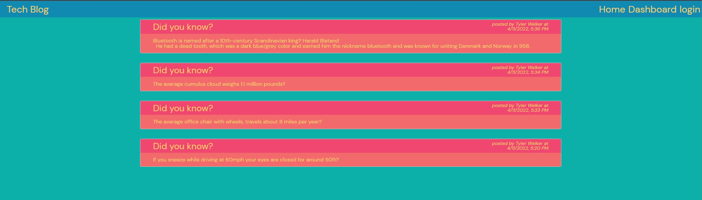

# Tech Blog

## Description
- This is a site that lets users share posts with other users.
- This was built for a connection or bringing together a community.
## Table of Contents
- [Installation](#installation)
- [Usage](#usage)
- [Credits](#credits)
- [License](#license)
## Installation
No need to install. just visit the application link below.
## Usage
To use just login or sign up and start posting.
## Credits
TWelk
## License
MIT
## How to Contribute
If you wish to contribute please contact TWelk
## Questions
* [gitHubLink](https://github.com/TWelk)
* <a href="mailto:it-support@kth.se">twelker08@gmail.com</a>
## Screenshot

## Live Site
* [Live](https://welktechblog-app.herokuapp.com/)
## Repo Link
* [Repo](https://github.com/TWelk/TechBlog)